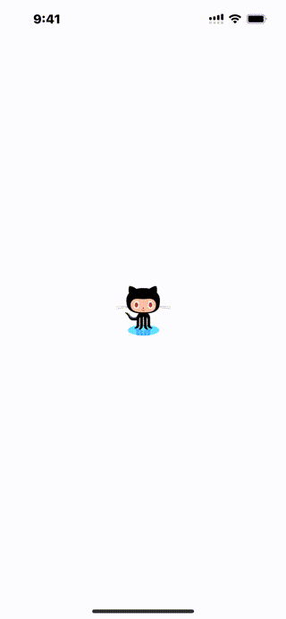

# WWSignInWith3rd+GitHub

[](https://developer.apple.com/swift/) [](https://developer.apple.com/swift/) [](https://developer.apple.com/swift/) [](https://developer.apple.com/swift/)

### [Introduction - 簡介](https://swiftpackageindex.com/William-Weng)
- [Use GitHub third-party login.](https://docs.github.com/en/apps/oauth-apps/maintaining-oauth-apps/modifying-an-oauth-app)
- [使用GitHub的第三方登入。](https://github.com/settings/developers)



### [Installation with Swift Package Manager](https://medium.com/彼得潘的-swift-ios-app-開發問題解答集/使用-spm-安裝第三方套件-xcode-11-新功能-2c4ffcf85b4b)
```js
dependencies: [
    .package(url: "https://github.com/William-Weng/WWSignInWith3rd_GitHub.git", .upToNextMajor(from: "1.0.0"))
]
```

### Function - 可用函式
|函式|功能|
|-|-|
|configure(clientId:secret:callbackURL:scope:)|參數設定|
|loginWithWeb(presenting:completion:)|登入 - 網頁|
|logoutWithWeb(contains:completion:)|登出 - 清除GitHub偷偷存在WebView裡面的Cookie值 => 記錄登入的值|

### Example
```swift
import UIKit
import WWPrint
import WWSignInWith3rd_Apple
import WWSignInWith3rd_GitHub

final class ViewController: UIViewController {

    override func viewDidLoad() {
        super.viewDidLoad()
        initSetting()
    }
    
    /// [GitHub 第三方登入](https://developer.github.com)
    @IBAction func signInWithGithub(_ sender: UIButton) {
        
        WWSignInWith3rd.GitHub.shared.loginWithWeb(presenting: self) { result in
            wwPrint(result)
        }
    }
}

// MARK: - 小工具
extension ViewController {
    
    func initSetting() {
        
        let clientId = "<clientId>"
        let secret = "<secret>"
        let callbackURL = "<callbackURL>"
        
        WWSignInWith3rd.GitHub.shared.configure(clientId: clientId, secret: secret, callbackURL: callbackURL)
    }
}
```
